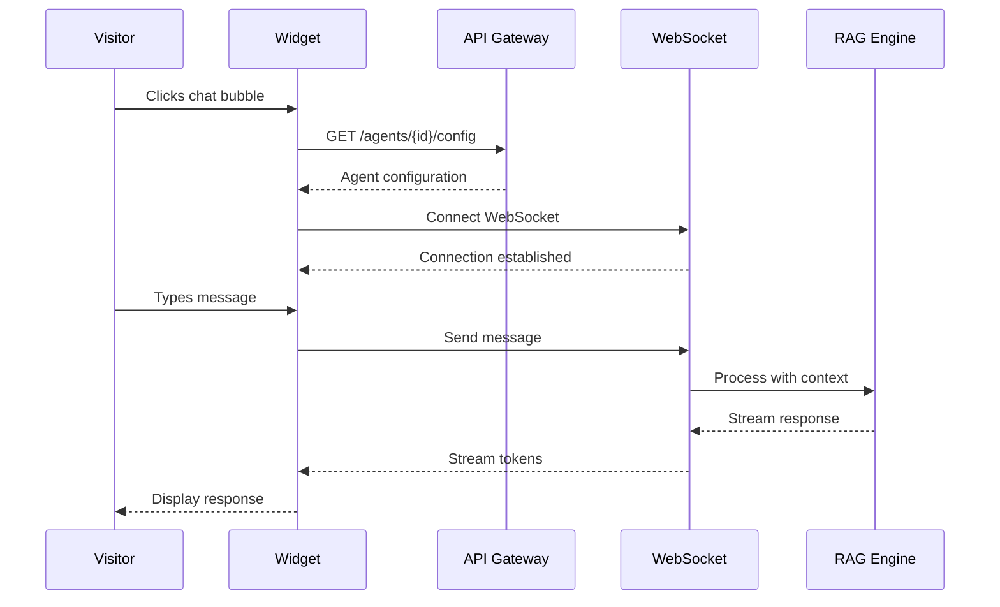
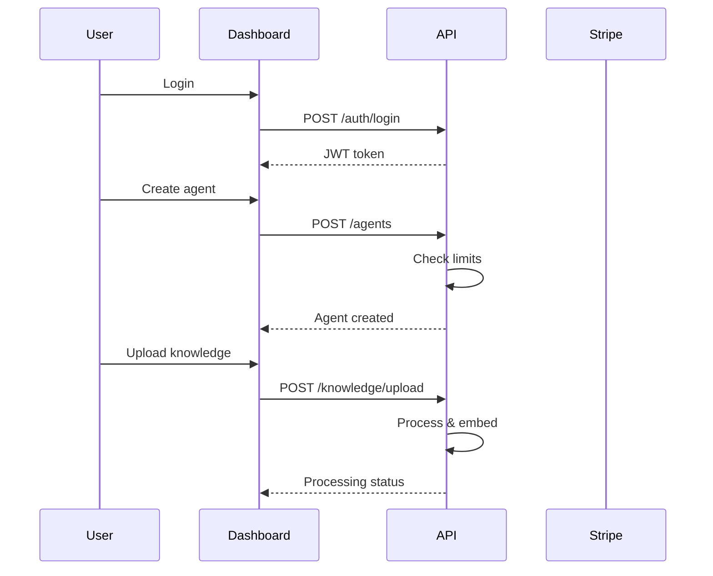

# NETVEXA Production Architecture & Design

## 🏗️ System Overview

NETVEXA is a multi-tenant SaaS platform providing AI-powered customer support agents. This document outlines the complete production architecture, deployment strategy, and operational considerations.

## 📊 High-Level Architecture

```
┌─────────────────────────────────────────────────────────────────┐
│                        Global CDN (CloudFront)                   │
│  • Static Assets (JS/CSS)  • Chat Widget  • Homepage Assets     │
└─────────────────────────────────────────────────────────────────┘
                                    │
┌─────────────────────────────────────────────────────────────────┐
│                    Application Load Balancer                     │
│              • SSL Termination  • Health Checks                  │
└─────────────────────────────────────────────────────────────────┘
                    │                               │
┌─────────────────────────┐     ┌─────────────────────────────────┐
│   Homepage (Next.js)    │     │    Dashboard (React SPA)        │
│   netvexa.com          │     │    app.netvexa.com             │
│   ECS Service (2 tasks) │     │    S3 + CloudFront             │
└─────────────────────────┘     └─────────────────────────────────┘
                                                    │
┌─────────────────────────────────────────────────────────────────┐
│                     API Gateway + WAF                            │
│              • Rate Limiting  • DDoS Protection                  │
└─────────────────────────────────────────────────────────────────┘
                                    │
┌─────────────────────────────────────────────────────────────────┐
│                  Backend API (FastAPI)                           │
│            ECS Fargate Service (Auto-scaling)                    │
│  ┌─────────────┐  ┌─────────────┐  ┌─────────────────────┐    │
│  │   Auth      │  │   Billing   │  │   Chat/WebSocket    │    │
│  │   Service   │  │   Service   │  │     Service         │    │
│  └─────────────┘  └─────────────┘  └─────────────────────┘    │
│  ┌─────────────┐  ┌─────────────┐  ┌─────────────────────┐    │
│  │    RAG      │  │  Knowledge  │  │   Agent Management  │    │
│  │   Engine    │  │  Ingestion  │  │     Service         │    │
│  └─────────────┘  └─────────────┘  └─────────────────────┘    │
└─────────────────────────────────────────────────────────────────┘
                    │                               │
┌─────────────────────────┐     ┌─────────────────────────────────┐
│   PostgreSQL (RDS)      │     │      Redis Cluster              │
│   • Multi-AZ            │     │   • ElastiCache                 │
│   • pgvector extension  │     │   • Session/Cache               │
└─────────────────────────┘     └─────────────────────────────────┘
                    │                               │
┌─────────────────────────────────────────────────────────────────┐
│                    S3 Storage Buckets                            │
│  • Documents  • Embeddings  • Backups  • Static Assets         │
└─────────────────────────────────────────────────────────────────┘
```

## 🏢 Multi-Tenancy & Client Isolation

### 1. Database Level Isolation

```sql
-- Row Level Security (RLS) for tenant isolation
CREATE POLICY tenant_isolation ON knowledge_documents
  FOR ALL TO application_role
  USING (tenant_id = current_setting('app.current_tenant_id')::uuid);

-- Separate schemas per tier
CREATE SCHEMA tenant_free;     -- Free tier shared schema
CREATE SCHEMA tenant_paid;     -- Paid tier shared schema  
CREATE SCHEMA tenant_enterprise_001; -- Dedicated schema for enterprise
```

### 2. Application Level Isolation

```python
# Tenant middleware
class TenantMiddleware:
    async def __call__(self, request: Request, call_next):
        # Extract tenant from JWT or subdomain
        tenant_id = extract_tenant_id(request)
        
        # Set tenant context
        request.state.tenant_id = tenant_id
        
        # Set database session context
        async with get_db_session() as session:
            await session.execute(
                f"SET app.current_tenant_id = '{tenant_id}'"
            )
```

### 3. Infrastructure Isolation

- **Starter/Growth**: Shared infrastructure with logical separation
- **Professional**: Dedicated compute resources, shared database
- **Business/Enterprise**: 
  - Dedicated VPC subnet
  - Isolated database instance
  - Dedicated Redis namespace
  - Optional: Dedicated Kubernetes namespace

## 💰 LLM Cost Management

### 1. Tiered LLM Strategy

```python
LLM_TIER_CONFIG = {
    "starter": {
        "primary": "gemini-1.5-flash",      # $0.075/1M tokens
        "fallback": "gpt-3.5-turbo",        # $0.50/1M tokens
        "max_tokens": 2048,
        "cache_ttl": 3600  # 1 hour
    },
    "growth": {
        "primary": "gemini-1.5-pro",        # $1.25/1M tokens
        "fallback": "claude-3-haiku",       # $0.25/1M tokens
        "max_tokens": 4096,
        "cache_ttl": 1800  # 30 minutes
    },
    "professional": {
        "primary": "gpt-4-turbo",           # $10/1M tokens
        "fallback": "claude-3-sonnet",      # $3/1M tokens
        "max_tokens": 8192,
        "cache_ttl": 900   # 15 minutes
    },
    "business": {
        "primary": "claude-3-opus",         # $15/1M tokens
        "fallback": "gpt-4",                # $30/1M tokens
        "max_tokens": 16384,
        "cache_ttl": 300   # 5 minutes
    }
}
```

### 2. Cost Optimization Strategies

#### A. Semantic Caching
```python
class SemanticCache:
    def __init__(self, redis_client, embedding_model):
        self.redis = redis_client
        self.embedder = embedding_model
        
    async def get_or_compute(self, query: str, agent_id: str):
        # Generate query embedding
        query_embedding = await self.embedder.embed(query)
        
        # Search for similar cached responses
        cached = await self.redis.search_similar(
            query_embedding, 
            threshold=0.95,  # High similarity threshold
            namespace=f"cache:{agent_id}"
        )
        
        if cached:
            return cached["response"]
            
        # Compute new response
        response = await self.llm.generate(query)
        
        # Cache with embedding
        await self.redis.cache_with_embedding(
            query, query_embedding, response,
            ttl=self.tier_config["cache_ttl"]
        )
        
        return response
```

#### B. Request Batching
```python
class BatchProcessor:
    def __init__(self, batch_size=10, max_wait_ms=100):
        self.batch_size = batch_size
        self.max_wait_ms = max_wait_ms
        self.pending_requests = []
        
    async def process_request(self, request):
        # Add to batch
        future = asyncio.Future()
        self.pending_requests.append((request, future))
        
        # Process if batch is full or timeout
        if len(self.pending_requests) >= self.batch_size:
            await self._process_batch()
        else:
            asyncio.create_task(self._timeout_processor())
            
        return await future
```

#### C. Response Streaming & Early Termination
```python
async def stream_with_budget(prompt: str, max_cost: float):
    total_tokens = 0
    cost_per_token = 0.00001  # Example rate
    
    async for chunk in llm.stream(prompt):
        total_tokens += chunk.token_count
        current_cost = total_tokens * cost_per_token
        
        if current_cost > max_cost:
            yield {"text": chunk.text, "terminated": True}
            break
            
        yield {"text": chunk.text, "terminated": False}
```

## 🚀 CDN & Widget Delivery

### 1. Widget Architecture

```javascript
// Lightweight loader (2KB gzipped)
(function() {
    var script = document.createElement('script');
    script.async = true;
    script.src = 'https://cdn.netvexa.com/widget/v1/netvexa.min.js';
    script.setAttribute('data-agent-id', 'AGENT_ID');
    document.head.appendChild(script);
})();
```

### 2. CDN Configuration

```yaml
# CloudFront Distribution
Origins:
  - DomainName: widget.s3.amazonaws.com
    S3OriginConfig:
      OriginAccessIdentity: !Ref WidgetOAI

Behaviors:
  - PathPattern: "/widget/*"
    TargetOriginId: WidgetOrigin
    ViewerProtocolPolicy: redirect-to-https
    CachePolicyId: !Ref WidgetCachePolicy
    ResponseHeadersPolicyId: !Ref CORSPolicy

CachePolicy:
  DefaultTTL: 86400  # 24 hours
  MaxTTL: 31536000   # 1 year
  HeadersConfig:
    Headers: ["Origin", "Access-Control-Request-Method"]
```

### 3. Version Management

```
CDN Structure:
/widget/
  /v1/
    netvexa.min.js       (latest stable)
    netvexa.min.js.map
  /v2/
    netvexa.min.js       (next version)
  /beta/
    netvexa.min.js       (testing)
  /config/
    {agent-id}.json      (per-agent config, 5min cache)
```

## 🔄 Deployment Strategy

### 1. Blue-Green Deployment

```yaml
# ECS Service Update
UpdateStrategy:
  Type: BlueGreen
  BlueGreenDeploymentConfiguration:
    TerminateBlueInstancesOnDeploymentSuccess:
      Action: TERMINATE
      TerminationWaitTimeInMinutes: 5
    GreenFleetProvisioningOption:
      Action: COPY_AUTO_SCALING_GROUP
    LoadBalancerInfo:
      TargetGroupPairInfoList:
        - ProdTrafficRoute:
            ListenerArns: [!Ref ALBListener]
          TargetGroups:
            - Name: !Ref BlueTargetGroup
            - Name: !Ref GreenTargetGroup
```

### 2. Database Migrations

```python
# Alembic with zero-downtime migrations
def upgrade():
    # Step 1: Add new column (nullable)
    op.add_column('users', 
        sa.Column('new_field', sa.String(), nullable=True)
    )
    
    # Step 2: Backfill data (in batches)
    connection = op.get_bind()
    result = connection.execute('SELECT COUNT(*) FROM users')
    total = result.scalar()
    
    batch_size = 1000
    for offset in range(0, total, batch_size):
        op.execute(f"""
            UPDATE users 
            SET new_field = 'default' 
            WHERE id IN (
                SELECT id FROM users 
                LIMIT {batch_size} OFFSET {offset}
            )
        """)
    
    # Step 3: Make non-nullable (in next deployment)
    # op.alter_column('users', 'new_field', nullable=False)
```

## 📊 Monitoring & Observability

### 1. Metrics Stack

```yaml
Metrics:
  CloudWatch:
    - API response times (p50, p95, p99)
    - LLM token usage per tenant
    - Cache hit rates
    - WebSocket connection count
    
  Custom Metrics:
    - Cost per conversation
    - Time to first response
    - Conversation completion rate
    - Lead qualification accuracy
```

### 2. Distributed Tracing

```python
# OpenTelemetry integration
from opentelemetry import trace

tracer = trace.get_tracer(__name__)

@tracer.start_as_current_span("chat_message")
async def process_chat_message(message: ChatMessage):
    span = trace.get_current_span()
    span.set_attribute("tenant.id", message.tenant_id)
    span.set_attribute("agent.id", message.agent_id)
    
    with tracer.start_span("rag_retrieval"):
        context = await rag_engine.retrieve(message.content)
    
    with tracer.start_span("llm_generation"):
        response = await llm.generate(context)
    
    return response
```

## 👤 User Experience Flow

### 1. End User (Website Visitor)



### 2. Business User (Dashboard)



## 🔐 Security Considerations

### 1. API Security

```python
# Rate limiting per tier
RATE_LIMITS = {
    "starter": "100/hour",
    "growth": "1000/hour",
    "professional": "5000/hour",
    "business": "unlimited"
}

# API key scoping
API_KEY_SCOPES = {
    "read:agents": "List and view agents",
    "write:agents": "Create and modify agents",
    "read:conversations": "View conversations",
    "write:knowledge": "Upload knowledge documents"
}
```

### 2. Data Encryption

- **At Rest**: AWS KMS encryption for RDS, S3
- **In Transit**: TLS 1.3 for all connections
- **Application Level**: Field-level encryption for PII

```python
# Field-level encryption
class EncryptedField(TypeDecorator):
    impl = String
    
    def process_bind_param(self, value, dialect):
        if value is not None:
            return encrypt_value(value, current_app.config['FIELD_KEY'])
        return value
    
    def process_result_value(self, value, dialect):
        if value is not None:
            return decrypt_value(value, current_app.config['FIELD_KEY'])
        return value
```

## 🎯 Performance Targets

### SLAs by Tier

| Metric | Starter | Growth | Professional | Business |
|--------|---------|---------|--------------|----------|
| Uptime | 99.5% | 99.9% | 99.95% | 99.99% |
| Response Time (p95) | <2s | <1s | <500ms | <200ms |
| Chat Latency | <500ms | <300ms | <200ms | <100ms |
| Support Response | 48h | 24h | 4h | 1h |

### Scaling Triggers

```yaml
AutoScaling:
  API:
    TargetCPU: 70%
    TargetMemory: 80%
    TargetRequestCount: 1000/min
    ScaleOutCooldown: 60s
    ScaleInCooldown: 300s
    
  Database:
    ReadReplicas:
      MinCount: 1
      MaxCount: 5
      Trigger: CPU > 60% OR Connections > 80%
```

## 💾 Backup & Disaster Recovery

### 1. Backup Strategy

```yaml
Backups:
  Database:
    Type: Automated snapshots
    Frequency: Every 6 hours
    Retention: 30 days
    CrossRegion: us-west-2
    
  Embeddings:
    Type: S3 replication
    Mode: Continuous
    Destination: s3://backup-bucket-us-west-2
    
  Conversations:
    Type: DynamoDB streams → S3
    Format: Parquet
    Compression: Snappy
    Partitioning: year/month/day/hour
```

### 2. Recovery Procedures

- **RPO (Recovery Point Objective)**: 1 hour
- **RTO (Recovery Time Objective)**: 
  - Starter/Growth: 4 hours
  - Professional: 2 hours
  - Business: 30 minutes

## 🚦 Development Workflow

### 1. Environment Structure

```
Environments:
├── Development
│   ├── Local (Docker Compose)
│   └── Dev Cloud (Shared AWS account)
├── Staging
│   ├── Pre-prod data
│   └── Full AWS stack
└── Production
    ├── Multi-region
    └── Full redundancy
```

### 2. CI/CD Pipeline

```yaml
# GitHub Actions workflow
name: Deploy
on:
  push:
    branches: [main]

jobs:
  test:
    runs-on: ubuntu-latest
    steps:
      - uses: actions/checkout@v3
      - name: Run tests
        run: |
          docker-compose -f docker-compose.test.yml up --abort-on-container-exit
          
  build:
    needs: test
    steps:
      - name: Build and push
        run: |
          docker build -t $ECR_REPO:$GITHUB_SHA .
          docker push $ECR_REPO:$GITHUB_SHA
          
  deploy:
    needs: build
    steps:
      - name: Update ECS service
        run: |
          aws ecs update-service \
            --cluster production \
            --service netvexa-api \
            --force-new-deployment
```

## 📈 Growth & Scaling Plan

### Phase 1: Current (0-1K customers)
- Single region (us-east-1)
- Shared infrastructure
- Manual monitoring

### Phase 2: Growth (1K-10K customers)
- Multi-AZ deployment
- Read replicas
- Automated scaling
- 24/7 monitoring

### Phase 3: Scale (10K-100K customers)
- Multi-region active-active
- Global CDN presence
- ML-based optimization
- Dedicated infrastructure tiers

### Phase 4: Enterprise (100K+ customers)
- Edge computing
- Private cloud options
- White-label solutions
- Global presence

## 🎯 Success Metrics

### Technical KPIs
- API uptime: >99.9%
- Response time: <500ms p95
- Error rate: <0.1%
- Cache hit rate: >80%

### Business KPIs
- Customer acquisition cost: <$100
- Monthly churn: <5%
- LTV:CAC ratio: >3:1
- Gross margin: >70%

### User Experience KPIs
- Time to first value: <5 minutes
- Widget load time: <200ms
- Conversation completion: >80%
- User satisfaction: >4.5/5

---

This production design ensures NETVEXA can scale efficiently while maintaining performance, security, and cost-effectiveness across all customer tiers.