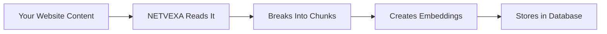

# How NETVEXA Works - A Beginner's Guide

## 🎯 What is NETVEXA?

NETVEXA is like a smart customer service representative that lives on your website. It can answer questions about your business, help visitors find what they need, and collect contact information from potential customers - all automatically, 24/7.

Think of it as:
- 🤖 A robot that reads and memorizes everything about your business
- 💬 Then chats with your website visitors
- 🎯 And tells you when someone is interested in buying

## 🏗️ The Building Blocks

### 1. **The Chat Window** (What visitors see)
```
┌─────────────────────────┐
│   NETVEXA Assistant     │
│                         │
│ 👤 Visitor: "Hi!"       │
│                         │
│ 🤖 Bot: "Hello! How     │
│    can I help?"         │
│                         │
│ [Type message...]  Send │
└─────────────────────────┘
```

### 2. **The Brain** (Backend Server)
- Runs on a computer in the cloud
- Processes messages
- Stores conversations
- Manages all the smart features

### 3. **The Database** (PostgreSQL)
- Like a filing cabinet that stores:
  - Your business information
  - Conversations
  - Customer details
  - Special "embeddings" (we'll explain these!)

### 4. **The AI Provider** (Gemini/Claude/GPT)
- The actual AI that generates responses
- Like hiring a very smart person to answer questions

## 🔄 The Complete Flow - Step by Step

### Step 1: Setting Up Your Business Knowledge



**What happens:**
1. You give NETVEXA your website URL or documents
2. NETVEXA reads all the content (like a speed reader)
3. Breaks it into small pieces (chunks) - like index cards
4. Creates "embeddings" for each piece (more on this below)
5. Stores everything in the database

### Step 2: When a Visitor Starts Chatting

```mermaid
graph TD
    A[Visitor Types: "What are your prices?"] --> B[Message Travels via WebSocket]
    B --> C[NETVEXA Backend Receives It]
    C --> D[Searches Knowledge Base]
    D --> E[Finds Relevant Info]
    E --> F[Asks AI to Create Response]
    F --> G[Sends Back to Visitor]
```

**The Journey of a Message:**

1. **Visitor types** → "What are your prices?"
2. **WebSocket sends it** → Like a phone line, instant connection
3. **Backend receives** → The server gets the message
4. **Searches knowledge** → Looks through all stored info
5. **Finds matches** → "Oh, pricing info is in chunk #47!"
6. **AI creates response** → "Our pricing starts at €99/month..."
7. **Sends back** → Visitor sees the answer instantly

## 🧠 Understanding Embeddings (The Magic Part)

### What are Embeddings?

Imagine you want to organize books in a library, but instead of alphabetical order, you want books with similar topics near each other. Embeddings do this for text!

**Regular Text:**
- "What is your pricing?" 
- "How much does it cost?"
- "Tell me about your rates"

**As Embeddings (simplified):**
```
"What is your pricing?" → [0.2, 0.8, 0.1, 0.5, ...]  (768 numbers)
"How much does it cost?" → [0.3, 0.7, 0.2, 0.4, ...] (768 numbers)
"Tell me about your rates" → [0.25, 0.75, 0.15, 0.45, ...] (768 numbers)
```

These number lists (vectors) are close to each other because the meanings are similar!

### Why 768 Numbers?

Think of it like describing a person:
- 1 number: Just height
- 2 numbers: Height and weight
- 768 numbers: Super detailed description including personality, appearance, skills, etc.

For text, 768 dimensions capture meaning very precisely!

## 💾 What's in the Database?

When you look in the database, you see:

### Table: `knowledge_documents`
| Column | What it stores | Example |
|--------|---------------|---------|
| id | Unique identifier | "f871e1c0-41fa-43a6..." |
| agent_id | Which agent owns this | "19a166d0-7f73-4354..." |
| title | Document title | "Chunk 0" |
| content | The actual text | "NETVEXA helps SMEs..." |
| embedding | 768 numbers | [0.23, -0.45, 0.67, ...] |
| meta_data | Extra info | {"source": "file", "page": 1} |
| created_at | When uploaded | "2025-08-02 22:35:40" |

### How Similarity Search Works

1. **Visitor asks:** "What's the cost?"
2. **Convert to embedding:** [0.3, 0.7, 0.2, ...] 
3. **Compare with all stored embeddings** using math (cosine similarity)
4. **Find closest matches** - like finding similar fingerprints
5. **Use that content** to answer the question

## 🔌 The Technology Stack Explained

### Docker Containers (The Boxes)
```
┌─────────────┐ ┌─────────────┐ ┌─────────────┐
│  PostgreSQL │ │    Redis    │ │   Backend   │
│  (Database) │ │   (Cache)   │ │  (FastAPI)  │
└─────────────┘ └─────────────┘ └─────────────┘
```
- Each box runs independently
- Like having separate appliances in your kitchen
- Can start/stop without affecting others

### WebSockets (The Real-time Connection)
- Regular websites: Like sending letters (request → wait → response)
- WebSockets: Like a phone call (always connected, instant messages)

### The Code Flow

1. **Frontend (JavaScript)**
   ```javascript
   // User types message
   websocket.send("Hello!")
   ```

2. **Backend receives (Python)**
   ```python
   # Get the message
   message = "Hello!"
   
   # Search knowledge base
   similar_docs = search_database(message)
   
   # Create response with AI
   response = ai.generate_response(message, similar_docs)
   
   # Send back
   websocket.send(response)
   ```

3. **Database operations**
   ```sql
   -- Finding similar content
   SELECT content 
   FROM knowledge_documents 
   WHERE embedding <=> [0.1, 0.2, ...] < 0.5
   ORDER BY similarity
   ```

## 🚀 Why This Architecture?

### Speed
- **Embeddings**: Search through thousands of documents in milliseconds
- **WebSockets**: No delay between messages
- **Caching**: Remember frequent questions

### Scalability
- **PostgreSQL**: Can handle millions of documents
- **Docker**: Easy to add more servers
- **Multiple AI providers**: Switch if one is down

### Intelligence
- **RAG (Retrieval Augmented Generation)**: AI answers based on YOUR specific content
- **Context awareness**: Remembers the conversation
- **Lead qualification**: Identifies interested customers

## 🎬 Putting It All Together

When you visit the NETVEXA demo:

1. **Page loads** → Connects via WebSocket
2. **Auto-ingests sample data** → Stores info about NETVEXA
3. **You type "What is NETVEXA?"**
4. **System**:
   - Creates embedding for your question
   - Searches database for similar content
   - Finds: "NETVEXA is an AI-powered business agent..."
   - Sends to Gemini AI with context
   - Gemini creates natural response
   - You see the answer
5. **All in < 2 seconds!**

## 🛠️ For Developers

The key files:
- `backend/main.py` - The FastAPI server
- `backend/rag/production_rag_engine.py` - Production RAG implementation
- `backend/rag/hybrid_search.py` - Hybrid search engine
- `backend/llm_providers.py` - AI connections (Gemini, Claude, GPT)
- `backend/database.py` - Database models and connections
- `dashboard/src/App.tsx` - React dashboard
- `backend/agent_routes.py` - Agent management endpoints
- `backend/knowledge_routes.py` - Document ingestion

## 📊 Monitoring Everything

In Beekeeper Studio, you can:
- See all stored documents
- View embeddings (the 768 numbers)
- Check conversations
- Monitor performance

## 🎯 The Business Value

This system allows:
- **Instant answers** - No waiting for human support
- **Accurate information** - Always based on your content
- **Lead capture** - Identifies interested visitors
- **24/7 availability** - Never sleeps
- **Cost effective** - One system, unlimited conversations

## 🔮 Summary

NETVEXA is like having a super-smart employee who:
1. Reads and memorizes everything about your business
2. Talks to every website visitor simultaneously
3. Never forgets anything
4. Works 24/7 without breaks
5. Tells you when someone wants to buy

The magic happens through:
- **Embeddings** (turning words into numbers)
- **Vector search** (finding similar meanings)
- **AI generation** (creating natural responses)
- **Real-time connections** (instant communication)

All working together to create a seamless experience for your visitors!