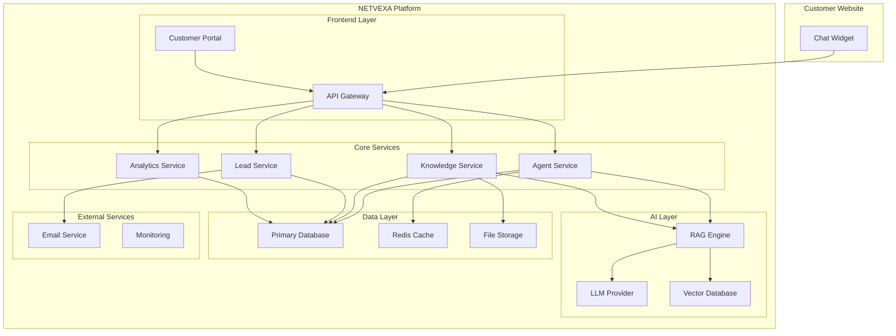

# Design Document

## Overview

NETVEXA is a cloud-native AI business agent platform built on a modular monolith architecture that can evolve into microservices. The system consists of a WordPress plugin for rapid market entry, a web-based customer portal, an embeddable chat widget, a RAG-powered AI engine using LlamaIndex, and supporting services for lead management and analytics. The platform is designed for rapid deployment (< 1 hour) and optimized for European SME requirements including GDPR compliance and multi-language support.

The architecture follows a market-first approach with WordPress plugin distribution as the primary customer acquisition channel, complemented by direct sales and Shopify integration for revenue diversification.

## Architecture

### High-Level Architecture



### Technology Stack

**Frontend:**
- Customer Portal: React.js with TypeScript
- Chat Widget: Vanilla JavaScript (for universal compatibility)
- Styling: Tailwind CSS for rapid development

**Backend:**
- API Gateway: Python with FastAPI
- Microservices: Python with FastAPI and Pydantic
- Real-time Communication: WebSocket (FastAPI WebSockets)

**AI/ML:**
- RAG Engine: LlamaIndex for RAG orchestration
- Vector Database: pgvector extension in PostgreSQL (75% cheaper than Pinecone)
- LLM Provider: Configurable (OpenAI GPT-4, Anthropic Claude, Google Gemini)
- Embeddings: Multiple providers - Google Universal Sentence Encoder (primary), OpenAI text-embedding-ada-002, Cohere embed-v3 (multilingual)

**Data Storage:**
- Primary Database: PostgreSQL with pgvector extension for structured data and embeddings
- Cache: Redis for session management, response caching, and conversation memory
- File Storage: AWS S3 for document storage
- Vector Storage: Integrated pgvector for cost optimization

**Infrastructure:**
- Cloud Provider: AWS (EU regions for GDPR compliance)
- Container Orchestration: Docker with ECS Fargate
- Background Processing: AWS Lambda for document processing
- CDN: CloudFront for global widget delivery
- Monitoring: Grafana with Prometheus

## Components and Interfaces

### 1. WordPress Plugin

**Purpose:** Primary distribution channel providing immediate market access through WordPress marketplace.

**Key Features:**
- One-click installation from WordPress.org
- Gutenberg block integration with live preview
- Shortcode support [netvexa_chat]
- WordPress admin panel integration
- Multi-site support for agencies

### 2. Customer Portal (app.netvexa.com)

**Purpose:** Web-based interface for SME customers to configure and manage their AI agents.

**Key Features:**
- Guided onboarding wizard
- Knowledge base management
- Agent customization
- Analytics dashboard
- Lead management

**API Endpoints:**
```python
# FastAPI endpoints with Pydantic models
from fastapi import FastAPI, Depends
from pydantic import BaseModel

class CustomerPortalAPI:
    # Authentication
    POST /auth/login
    POST /auth/register
    POST /auth/logout
    
    # Agent Management
    GET /agents/{agent_id}
    POST /agents
    PUT /agents/{agent_id}
    DELETE /agents/{agent_id}
    
    # Knowledge Management
    POST /knowledge/ingest-url
    POST /knowledge/upload-document
    GET /knowledge/status/{job_id}
    DELETE /knowledge/{knowledge_id}
    
    # Analytics
    GET /analytics/conversations
    GET /analytics/leads
    GET /analytics/performance
    
    # Customization
    PUT /agents/{agent_id}/appearance
    PUT /agents/{agent_id}/personality
    
    # LLM Configuration
    GET /llm/providers
    PUT /agents/{agent_id}/llm-config
```

### 3. Chat Widget

**Purpose:** Embeddable JavaScript widget that provides conversational interface on customer websites.

**Key Features:**
- Lightweight (<50KB compressed)
- Responsive design
- Customizable appearance
- Real-time messaging
- Lead capture forms

**Integration:**
```html
<script>
  (function(w,d,s,o,f,js,fjs){
    w['NetvexaWidget']=o;w[o]=w[o]||function(){(w[o].q=w[o].q||[]).push(arguments)};
    js=d.createElement(s),fjs=d.getElementsByTagName(s)[0];
    js.id=o;js.src=f;js.async=1;fjs.parentNode.insertBefore(js,fjs);
  }(window,document,'script','netvexa','https://widget.netvexa.com/widget.js'));
  
  netvexa('init', {
    agentId: 'agent_123',
    position: 'bottom-right',
    theme: 'light'
  });
</script>
```

### 3. Agent Service

**Purpose:** Core conversational AI service that handles chat interactions and lead qualification.

**Responsibilities:**
- Process incoming messages
- Generate contextual responses using RAG
- Identify and score leads
- Maintain conversation state
- Handle escalation to human agents

**Interface:**
```python
from pydantic import BaseModel
from typing import List, Optional
from enum import Enum

class LLMProvider(str, Enum):
    OPENAI = "openai"
    ANTHROPIC = "anthropic"
    GOOGLE = "google"

class AgentService:
    async def process_message(self, agent_id: str, message: ChatMessage) -> ChatResponse
    async def qualify_lead(self, conversation_id: str) -> LeadScore
    async def get_conversation_history(self, conversation_id: str) -> List[ChatMessage]
    async def update_agent_config(self, agent_id: str, config: AgentConfig) -> None
    async def switch_llm_provider(self, agent_id: str, provider: LLMProvider) -> None
```

interface ChatMessage {
  id: string
  conversationId: string
  sender: 'user' | 'agent'
  content: string
  timestamp: Date
  metadata?: Record<string, any>
}

interface ChatResponse {
  content: string
  suggestions?: string[]
  leadCapture?: LeadCaptureForm
  escalate?: boolean
}
```

### 4. Knowledge Service

**Purpose:** Manages knowledge ingestion, processing, and retrieval for RAG system.

**Responsibilities:**
- Crawl and extract content from websites
- Process uploaded documents
- Generate embeddings
- Store in vector database
- Provide semantic search capabilities

**Interface:**
```typescript
interface KnowledgeService {
  ingestWebsite(agentId: string, url: string): Promise<IngestionJob>
  ingestDocument(agentId: string, file: File): Promise<IngestionJob>
  getIngestionStatus(jobId: string): Promise<IngestionStatus>
  searchKnowledge(agentId: string, query: string): Promise<KnowledgeResult[]>
  deleteKnowledge(agentId: string, knowledgeId: string): Promise<void>
}

interface IngestionJob {
  id: string
  status: 'pending' | 'processing' | 'completed' | 'failed'
  progress: number
  documentsProcessed: number
  totalDocuments: number
}
```

### 5. Lead Service

**Purpose:** Manages lead qualification, scoring, and notification workflows.

**Responsibilities:**
- Score leads based on conversation analysis
- Send notifications to sales teams
- Track lead progression
- Integrate with CRM systems

**Interface:**
```typescript
interface LeadService {
  createLead(conversationId: string, contactInfo: ContactInfo): Promise<Lead>
  scoreLead(leadId: string): Promise<LeadScore>
  notifyTeam(leadId: string): Promise<void>
  updateLeadStatus(leadId: string, status: LeadStatus): Promise<void>
  getLeads(agentId: string, filters?: LeadFilters): Promise<Lead[]>
}

interface Lead {
  id: string
  agentId: string
  conversationId: string
  contactInfo: ContactInfo
  score: number
  status: LeadStatus
  createdAt: Date
  updatedAt: Date
}
```

## Data Models

### Core Entities

```typescript
// Agent Configuration
interface Agent {
  id: string
  customerId: string
  name: string
  description: string
  personality: AgentPersonality
  appearance: AgentAppearance
  knowledgeBaseIds: string[]
  isActive: boolean
  createdAt: Date
  updatedAt: Date
}

interface AgentPersonality {
  tone: 'professional' | 'friendly' | 'casual'
  language: 'en' | 'de' | 'fr' | 'es' | 'it'  // English primary, German first additional language
  responseStyle: 'concise' | 'detailed'
  leadQualificationThreshold: number
}

interface AgentAppearance {
  primaryColor: string
  secondaryColor: string
  fontFamily: string
  avatarUrl?: string
  position: 'bottom-left' | 'bottom-right'
}

// Knowledge Base
interface KnowledgeBase {
  id: string
  agentId: string
  name: string
  type: 'website' | 'document' | 'manual'
  source: string
  status: 'active' | 'processing' | 'error'
  documentCount: number
  lastUpdated: Date
}

interface KnowledgeDocument {
  id: string
  knowledgeBaseId: string
  title: string
  content: string
  url?: string
  metadata: Record<string, any>
  embedding: number[]
  createdAt: Date
}

// Conversation Management
interface Conversation {
  id: string
  agentId: string
  visitorId: string
  status: 'active' | 'completed' | 'escalated'
  leadScore: number
  startedAt: Date
  endedAt?: Date
  metadata: {
    userAgent: string
    referrer: string
    location?: string
  }
}

// Customer Management
interface Customer {
  id: string
  email: string
  companyName: string
  industry: string
  employeeCount: number
  country: string
  subscription: SubscriptionPlan
  createdAt: Date
}
```

## Error Handling

### Error Categories

1. **User Input Errors (4xx)**
   - Invalid agent configuration
   - Malformed chat messages
   - Authentication failures

2. **System Errors (5xx)**
   - LLM provider failures
   - Database connection issues
   - Vector database timeouts

3. **Business Logic Errors**
   - Knowledge ingestion failures
   - Lead scoring errors
   - Rate limiting violations

### Error Response Format

```typescript
interface ErrorResponse {
  error: {
    code: string
    message: string
    details?: Record<string, any>
    timestamp: Date
    requestId: string
  }
}
```

### Fallback Strategies

1. **LLM Provider Fallback:** Configurable primary provider → Secondary provider → Cached responses
   - Support for OpenAI, Anthropic Claude, Google Gemini
   - Per-agent LLM provider configuration
2. **Embedding Provider Fallback:** Google Universal Sentence Encoder → OpenAI embeddings → Cached embeddings
3. **Vector Database Fallback:** Semantic search → Keyword search → Default responses
4. **Real-time Communication:** WebSocket → Server-Sent Events → Polling
5. **Knowledge Ingestion:** Automatic retry with exponential backoff
6. **Language Support:** English (primary) → German and other supported languages → English fallback for unsupported content

## Testing Strategy

### Unit Testing
- **Coverage Target:** 90% for core business logic
- **Framework:** Jest with TypeScript support
- **Focus Areas:**
  - RAG retrieval accuracy
  - Lead scoring algorithms
  - Message processing logic
  - Knowledge ingestion workflows

### Integration Testing
- **API Testing:** Automated testing of all REST endpoints
- **Database Testing:** Test data consistency and migrations
- **External Service Testing:** Mock LLM providers and vector databases
- **Widget Testing:** Cross-browser compatibility testing

### End-to-End Testing
- **User Journeys:** Complete onboarding and agent deployment flows
- **Chat Interactions:** Realistic conversation scenarios
- **Lead Generation:** Full lead qualification and notification workflows
- **Performance Testing:** Load testing for concurrent conversations

### Performance Testing
- **Load Testing:** 1000 concurrent conversations per agent
- **Response Time:** <3 seconds for chat responses
- **Throughput:** 10,000 messages per minute per service
- **Scalability:** Auto-scaling based on conversation volume

### Security Testing
- **GDPR Compliance:** Data processing and storage validation
- **Input Validation:** SQL injection and XSS prevention
- **Authentication:** JWT token security and session management
- **Rate Limiting:** API abuse prevention

## Deployment and Monitoring

### Deployment Strategy
- **Blue-Green Deployment:** Zero-downtime updates
- **Feature Flags:** Gradual rollout of new features
- **Database Migrations:** Automated schema updates
- **CDN Updates:** Automatic widget version distribution

### Monitoring and Observability
- **Grafana Dashboards:** 
  - Application metrics (response times, error rates, throughput)
  - Business metrics (lead generation, conversion rates, user engagement)
  - Infrastructure metrics (CPU, memory, database performance)
  - LLM provider performance and costs
- **Prometheus Metrics:** Custom metrics collection for all services
- **Real-time Alerts:** Critical error notifications and SLA violations via Grafana alerting
- **Multi-language Monitoring:** Conversation quality and accuracy metrics across English, German, and other supported languages

### Success Metrics Tracking
- **Deployment Time:** <60 minutes from signup to active agent
- **First Lead Generation:** <7 days tracking
- **Self-Service Rate:** >70% automated resolution
- **Response Time:** <3 seconds average
- **Uptime:** 99.9% availability SLA

## WordPress Plugin Integration

### Plugin Architecture
The WordPress plugin serves as the primary customer acquisition channel, providing immediate access to 43% of all websites. The plugin integrates seamlessly with WordPress admin and provides both shortcode and Gutenberg block functionality.

### Key Integration Points
- **WordPress Admin Integration:** Native admin panel for agent configuration
- **Gutenberg Blocks:** Visual editor integration with live preview
- **Shortcode Support:** `[netvexa_chat]` for flexible placement
- **Multi-site Support:** Agency-friendly with centralized management
- **Auto-updates:** Seamless plugin updates through WordPress.org

### Revenue Model Integration
- **Freemium Approach:** Basic functionality free, premium features paid
- **Usage-based Billing:** Conversation limits with upgrade prompts
- **Direct Integration:** Seamless upgrade flow to full platform